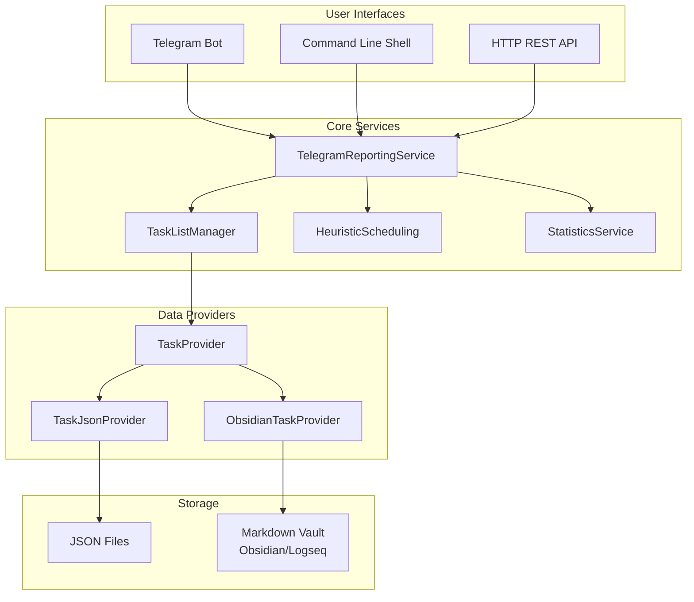

# Architecture Documentation

## Overview

A Python-based task management application with multiple interfaces (Telegram bot, command line, and HTTP REST API) that helps users manage, schedule, and track tasks efficiently.

### Architecture Overview



## Key Features

| Feature | Description |
|---------|-------------|
| **Multiple Storage Modes** | JSON file storage or Markdown vault (Obsidian/Logseq compatible) |
| **Multiple Interfaces** | Telegram bot, command-line shell, or HTTP REST API |
| **Task Scheduling** | Heuristic-based task prioritization with automatic splitting |
| **Categories/Contexts** | Organize tasks by context (indoor, outdoor, workstation, etc.) |
| **Statistics Tracking** | Track work done and productivity metrics |
| **Event System** | Tasks can wait for and raise events for dependency management |

## Technology Stack

- **Language**: Python 3.11
- **Dependencies**:
  - `python-telegram-bot` - Telegram bot integration
  - `dependency-injector` - Dependency injection container
  - `aiohttp` - HTTP server for REST API
- **Deployment**: Docker support with compose.yaml

## Project Structure

```
advanced-task-manager/
├── backend/
│   ├── backend.py              # Main entry point
│   ├── src/
│   │   ├── containers/         # DI container configuration
│   │   ├── taskmodels/         # Task model classes
│   │   ├── taskproviders/      # Data providers for tasks
│   │   ├── taskjsonproviders/  # JSON/Obsidian parsing
│   │   ├── heuristics/         # Task prioritization algorithms
│   │   ├── filters/            # Task filtering logic
│   │   ├── algorithms/         # GTD, EDF, Shortest Job algorithms
│   │   ├── wrappers/           # External service adapters
│   │   └── Interfaces/         # Abstract interfaces
│   └── tests/                  # Test suite
├── config.json                 # User configuration
├── tasks.json                  # Task data storage
├── statistics.json             # Work statistics
├── Dockerfile
└── compose.yaml
```

## Available Commands

| Command | Description |
|---------|-------------|
| `/list` | List tasks in current view |
| `/next` / `/previous` | Navigate task pages |
| `/task_[N]` | Select a specific task |
| `/info` | Show detailed task information |
| `/new [desc]` | Create a new task |
| `/done` | Mark selected task complete |
| `/set [param] [value]` | Modify task properties |
| `/schedule` | Reschedule task with effort distribution |
| `/work [time]` | Log work done on task |
| `/snooze [time]` | Delay task start time |
| `/stats` | View work statistics |
| `/agenda` | Show today's tasks |
| `/search [terms]` | Search for tasks |
| `/heuristic` / `/filter` | Select sorting/filtering strategy |
| `/algorithm` | Select task sorting algorithm |

## Task Model Properties

Each task contains:
- **description** - Task title
- **context** - Category prefix (alert, billable, indoor, outdoor, etc.)
- **start** - When task becomes available
- **due** - Deadline
- **severity** - Priority weight
- **totalCost** - Estimated effort (in pomodoros)
- **investedEffort** - Work already done
- **status** - Completion status
- **calm** - Flag for low-urgency tasks
- **waited/raised** - Event dependency system

## Operating Modes

| Mode | Storage | Interface | APP_MODE |
|------|---------|-----------|----------|
| Obsidian (cmd) | Markdown vault | Command line | 1 |
| JSON file (cmd) | JSON file | Command line | 2 |
| JSON file (telegram) | JSON file | Telegram bot | 3 |
| Obsidian (telegram) | Markdown vault | Telegram bot | 4 |
| JSON file (HTTP) | JSON file | REST API | 5 |
| Obsidian (HTTP) | Markdown vault | REST API | 6 |

## Heuristics for Task Prioritization

The application uses several heuristics to prioritize tasks:
- **Remaining Effort** - Prioritizes by remaining work
- **Days to Threshold** - Time-based urgency
- **Slack Heuristic** - Balance between available time and work
- **CFD Heuristic** - Critical path analysis
- **Start Time Heuristic** - Prioritize by availability
- **Workload Heuristic** - Prioritizes by calculating remaining cost divided by remaining days (remaining_cost / remaining_days)

## Core Components

### TelegramReportingService

The main service that handles user interactions through the configured interface. It processes commands, manages task lists, and coordinates between different components.

### TaskListManager

Manages the filtered and sorted view of tasks. Handles pagination, task selection, and applies heuristics/filters/algorithms.

### HeuristicScheduling

Implements the scheduling algorithm that can automatically split tasks when the required effort per day would result in severity < 1.

### StatisticsService

Tracks work done on tasks, calculates productivity metrics, and provides statistics for the agenda view.

### Dependency Injection

The application uses `dependency-injector` to manage component lifecycle and dependencies. See `backend/src/containers/TelegramReportingServiceContainer.py` for the full container configuration.