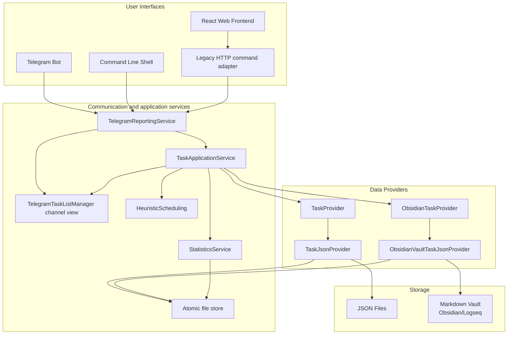

# Architecture Documentation

## Overview

A Python-based task management application with multiple interfaces (Telegram bot, command line, and a command-oriented HTTP API) that helps users manage, schedule, and track tasks efficiently.

### Architecture Overview


```mermaid
graph TB
    subgraph "User Interfaces"
        A[Telegram Bot]
        B[Command Line Shell]
        C[Legacy HTTP command adapter]
        M[React Web Frontend]
    end

    subgraph "Communication and application services"
        D[TelegramReportingService]
        E[TaskApplicationService]
        F[TelegramTaskListManager channel view]
        G[HeuristicScheduling]
        H[StatisticsService]
        P[Atomic file store]
    end

    subgraph "Data Providers"
        I[TaskProvider]
        J[TaskJsonProvider]
        K[ObsidianTaskProvider]
        L[ObsidianVaultTaskJsonProvider]
    end

    subgraph "Storage"
        N[JSON Files]
        O[Markdown Vault<br/>Obsidian/Logseq]
    end

    A --> D
    B --> D
    C --> D
    M --> C
    D --> E
    D --> F
    E --> F
    E --> G
    E --> H
    E --> I
    E --> K
    I --> J
    J --> N
    K --> L
    L --> O
    J --> P
    L --> P
    H --> P
```

## Key Features

| Feature | Description |
|---------|-------------|
| **Multiple Storage Modes** | JSON file storage or Markdown vault (Obsidian/Logseq compatible) |
| **Multiple Interfaces** | Telegram bot, command-line shell, or command-oriented HTTP API |
| **Task Scheduling** | Heuristic-based task prioritization with automatic splitting |
| **Categories/Contexts** | Organize tasks by context (indoor, outdoor, workstation, etc.) |
| **Statistics Tracking** | Track work done and productivity metrics |
| **Event System** | Tasks can wait for and raise events for dependency management |

## Technology Stack

- **Language**: Python 3.11
- **Frontend**: React + TypeScript + Vite
- **Dependencies**:
  - `python-telegram-bot` - Telegram bot integration
  - `dependency-injector` - Dependency injection container
  - `aiohttp` - HTTP server for REST API
- **Deployment**: Docker support with compose.yaml

## Project Structure

```
advanced-task-manager/
├── frontend/
│   ├── src/
│   │   ├── api/                # Typed HTTP client and command wrappers
│   │   ├── components/         # Reusable UI components
│   │   ├── hooks/              # Local storage and polling hooks
│   │   ├── types/              # API response type definitions
│   │   └── utils/              # Formatting and helper utilities
│   └── package.json
├── backend/
│   ├── backend.py              # Main entry point
│   ├── src/
│   │   ├── containers/         # DI container configuration
│   │   ├── taskmodels/         # Task model classes
│   │   ├── taskproviders/      # Data providers for tasks
│   │   ├── taskjsonproviders/  # JSON/Obsidian parsing
│   │   ├── heuristics/         # Task prioritization algorithms
│   │   ├── filters/            # Task filtering logic
│   │   ├── algorithms/         # GTD, EDF, Shortest Job algorithms
│   │   ├── wrappers/           # External service adapters
│   │   └── Interfaces/         # Abstract interfaces (ILogger, ITaskModel, IFilter, etc.)
│   └── tests/                  # Test suite
├── config.json                 # User configuration
├── tasks.json                  # Task data storage
├── statistics.json             # Work statistics
├── Dockerfile
└── compose.yaml
```

## Available Commands

| Command | Description |
|---------|-------------|
| `/list` | List tasks in current view |
| `/next` / `/previous` | Navigate task pages |
| `/task_[N]` | Select a specific task |
| `/info` | Show detailed task information |
| `/new [desc]` | Create a new task |
| `/done` | Mark selected task complete |
| `/set [param] [value]` | Modify task properties |
| `/schedule` | Reschedule task with effort distribution |
| `/work [time]` | Log work done on task |
| `/snooze [time]` | Delay task start time |
| `/stats` | View work statistics |
| `/agenda` | Show today's tasks |
| `/search [terms]` | Search for tasks |
| `/heuristic` / `/filter` | Select sorting/filtering strategy |
| `/algorithm` | Select task sorting algorithm |

## Task Model Properties

Each task contains:
- **description** - Task title
- **context** - Category prefix (alert, billable, indoor, outdoor, etc.)
- **start** - When task becomes available
- **due** - Deadline
- **severity** - Priority weight
- **totalCost** - Estimated effort (in pomodoros)
- **investedEffort** - Work already done
- **status** - Completion status
- **calm** - Flag for low-urgency tasks
- **waited/raised** - Event dependency system

## Operating Modes

| Mode | Storage | Interface | APP_MODE |
|------|---------|-----------|----------|
| Obsidian (cmd) | Markdown vault | Command line | 1 |
| JSON file (cmd) | JSON file | Command line | 2 |
| JSON file (telegram) | JSON file | Telegram bot | 3 |
| Obsidian (telegram) | Markdown vault | Telegram bot | 4 |
| JSON file (API) | JSON file | HTTP command adapter | 5 |
| Obsidian (API) | Markdown vault | HTTP command adapter | 6 |

Modes 5/6 use the legacy command-style HTTP adapter described below. They do not provide a resource-oriented `/api/v1/` interface, require HTTPS, or isolate task-list views by client.

## Heuristics for Task Prioritization

The application uses several heuristics to prioritize tasks:
- **Remaining Effort** - Prioritizes by remaining work
- **Days to Threshold** - Time-based urgency
- **Slack Heuristic** - Balance between available time and work
- **CFD Heuristic** - Critical path analysis
- **Start Time Heuristic** - Prioritize by availability
- **Workload Heuristic** - Prioritizes by calculating remaining cost divided by remaining days (remaining_cost / remaining_days)

## Core Components

### TaskApplicationService

`TaskApplicationService` provides task reads and queries from the configured data providers. Query methods accept explicit task-view inputs and use a temporary manager with copies of the filter, heuristic and algorithm settings, leaving the configured manager's page, selection and view unchanged. This keeps an individual query from changing the current view; it does not give HTTP clients independent managers. `APP_MODE` selects one interface and one channel manager, whose view state is shared by requests.

Task IDs are opaque values stored with their tasks: JSON uses the `id` field, and Markdown uses `[id:: value]` on the task line. For older tasks without a declared ID, JSON derives an MD5 fallback from the description, configured file path and zero-based position in the full task array; Markdown derives it from the description, file path and line number. Reads calculate the fallback without writing it. The first actual write stores that value, which then remains stable across edits and moves. Resolution scans completed as well as open tasks: a lookup for an ID with no matching task reports absence, while duplicate IDs are ambiguous and block writes to that ID. MD5 can collide, so the fallback is not guaranteed to be unique.

Provider `getJson()` and `getTaskList()` reads parse the current JSON or Markdown data without running discovery or persisting fallback IDs. Startup initialization is explicit, and the provider maintenance cycle retains its configured 10-second cadence. Reading an open project without an open next action does not create or save `Define next action`; explicit discovery may create it. Task updates preserve completed rows and fields outside the update. If task or statistics files are missing, reads use in-memory defaults until initialization or a write creates the files.

### File persistence

The shared file store writes a complete candidate into an exclusive temporary file beside its destination, flushes and synchronizes it, preserves applicable permissions, then replaces the destination atomically. The store checks for external changes before replacement and retries from fresh file contents where it can; editors that do not cooperate can still race after that check. Memory snapshots are published only after the replacement is confirmed. A failure before replacement has no effect on that file; a failure after replacement can leave durability uncertain. Each file is atomic independently. Operations spanning task, statistics, project, or several task files stop at the first failure, keep earlier confirmed writes, and report known and uncertain effects for manual review without rollback or automatic retry.

### TelegramReportingService

The main service that handles user interactions through the configured interface. It processes commands, manages task lists, and coordinates between different components.

### HttpUserCommService (legacy)

`HttpUserCommService` exposes command-style paths where each URL path maps to a `TelegramReportingService` command (`/list`, `/stats`, `/agenda`, and others), with an optional query argument string (`args`). The frontend uses GET requests. These requests are not all read-only: commands may change task-list selection or view, write task or project data, initialize statistics state, or drain volatile notifications. The application service is not exposed as a resource-oriented HTTP API.

### React Frontend

The `frontend/` application consumes the API with a typed client layer:
- Handles bearer authentication and backend timeout/error mapping.
- Supports mixed backend payloads (JSON and plain text fallback).
- Uses a Vite `/api` development proxy to avoid backend CORS changes.
- Provides task operations and dashboards for agenda, stats, and event analysis.

### TaskListManager

Manages the filtered and sorted view of tasks. Handles pagination, task selection, and applies heuristics/filters/algorithms.

### HeuristicScheduling

Implements the scheduling algorithm that can automatically split tasks when the required effort per day would result in severity < 1.

### StatisticsService

Tracks work done on tasks, calculates productivity metrics, and provides statistics for the agenda view.

### Dependency Injection

The application uses `dependency-injector` to manage component lifecycle and dependencies. See `backend/src/containers/TelegramReportingServiceContainer.py` for the full container configuration.

## Transport scope for extension integration

HTTPS support for the extension integration is pending implementation, and the backend does not require HTTPS for API mode. The backend also has no persistent, non-destructive notification history: notifications live in a volatile shared queue, and a read may drain it. Treat only one client as the notification consumer while this queue is used. GET commands that access other services can also have side effects, as described above.
