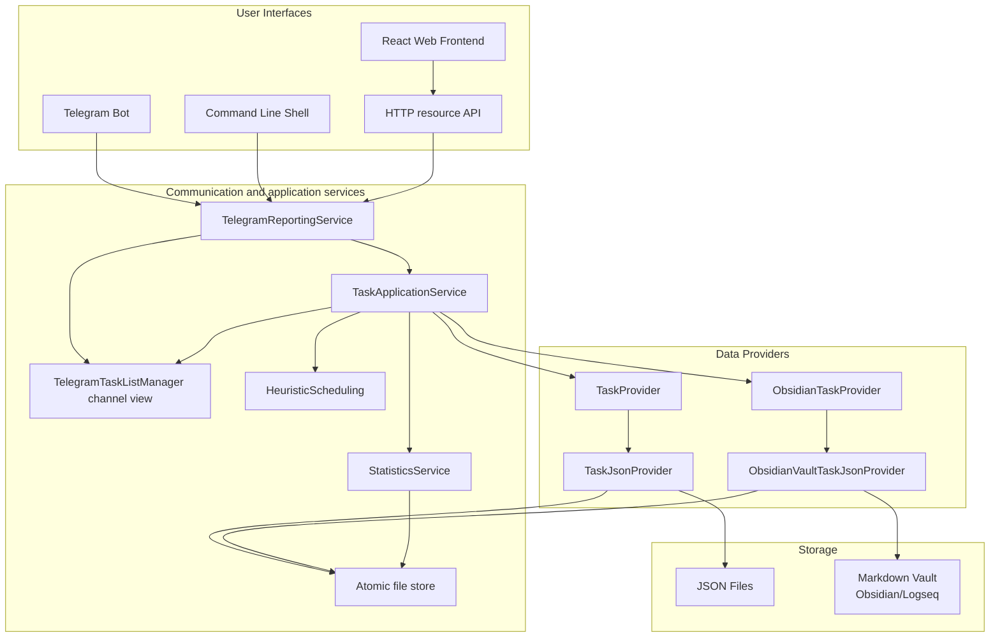

# Architecture Documentation

## Overview

A Python-based task management application with Telegram, command-line and resource-oriented HTTP interfaces for managing, scheduling and tracking tasks.

### Architecture Overview


```mermaid
graph TB
    subgraph "User Interfaces"
        A[Telegram Bot]
        B[Command Line Shell]
        C[HTTP resource API]
        M[React Web Frontend]
    end

    subgraph "Communication and application services"
        D[TelegramReportingService]
        E[TaskApplicationService]
        F[TelegramTaskListManager channel view]
        G[HeuristicScheduling]
        H[StatisticsService]
        P[Atomic file store]
    end

    subgraph "Data Providers"
        I[TaskProvider]
        J[TaskJsonProvider]
        K[ObsidianTaskProvider]
        L[ObsidianVaultTaskJsonProvider]
    end

    subgraph "Storage"
        N[JSON Files]
        O[Markdown Vault<br/>Obsidian/Logseq]
    end

    A --> D
    B --> D
    C --> D
    M --> C
    D --> E
    D --> F
    E --> F
    E --> G
    E --> H
    E --> I
    E --> K
    I --> J
    J --> N
    K --> L
    L --> O
    J --> P
    L --> P
    H --> P
```

## Key Features

| Feature | Description |
|---------|-------------|
| **Multiple Storage Modes** | JSON file storage or Markdown vault (Obsidian/Logseq compatible) |
| **Multiple Interfaces** | Telegram bot, command-line shell, or resource-oriented HTTP API |
| **Task Scheduling** | Heuristic-based task prioritization with automatic splitting |
| **Categories/Contexts** | Organize tasks by context (indoor, outdoor, workstation, etc.) |
| **Statistics Tracking** | Track work done and productivity metrics |
| **Event System** | Tasks can wait for and raise events for dependency management |

## Technology Stack

- **Language**: Python 3.11
- **Frontend**: React + TypeScript + Vite
- **Dependencies**:
  - `python-telegram-bot` - Telegram bot integration
  - `dependency-injector` - Dependency injection container
  - `aiohttp` - HTTP server for REST API
- **Deployment**: Docker support with compose.yaml

## Project Structure

```
advanced-task-manager/
├── frontend/
│   ├── src/
│   │   ├── api/                # HTTP client and request wrappers
│   │   ├── components/         # Reusable UI components
│   │   ├── hooks/              # Local storage and polling hooks
│   │   ├── types/              # API response type definitions
│   │   └── utils/              # Formatting and helper utilities
│   └── package.json
├── backend/
│   ├── backend.py              # Main entry point
│   ├── src/
│   │   ├── containers/         # DI container configuration
│   │   ├── taskmodels/         # Task model classes
│   │   ├── taskproviders/      # Data providers for tasks
│   │   ├── taskjsonproviders/  # JSON/Obsidian parsing
│   │   ├── heuristics/         # Task prioritization algorithms
│   │   ├── filters/            # Task filtering logic
│   │   ├── algorithms/         # GTD, EDF, Shortest Job algorithms
│   │   ├── wrappers/           # External service adapters
│   │   └── Interfaces/         # Abstract interfaces (ILogger, ITaskModel, IFilter, etc.)
│   └── tests/                  # Test suite
├── config.json                 # User configuration
├── tasks.json                  # Task data storage
├── statistics.json             # Work statistics
├── Dockerfile
└── compose.yaml
```

## Command-line and Telegram Commands

| Command | Description |
|---------|-------------|
| `/list` | List tasks in current view |
| `/next` / `/previous` | Navigate task pages |
| `/task_[N]` | Select a specific task |
| `/info` | Show detailed task information |
| `/new [desc]` | Create a new task |
| `/done` | Mark selected task complete |
| `/set [param] [value]` | Modify task properties |
| `/schedule` | Reschedule task with effort distribution |
| `/work [time]` | Log work done on task |
| `/snooze [time]` | Delay task start time |
| `/stats` | View work statistics |
| `/agenda` | Show today's tasks |
| `/search [terms]` | Search for tasks |
| `/heuristic` / `/filter` | Select sorting/filtering strategy |
| `/algorithm` | Select task sorting algorithm |

## Task Model Properties

Each task contains:
- **description** - Task title
- **context** - Category prefix (alert, billable, indoor, outdoor, etc.)
- **start** - When task becomes available
- **due** - Deadline
- **severity** - Priority weight
- **totalCost** - Estimated effort (in pomodoros)
- **investedEffort** - Work already done
- **status** - Completion status
- **calm** - Flag for low-urgency tasks
- **waited/raised** - Event dependency system

## Operating Modes

| Mode | Storage | Interface | APP_MODE |
|------|---------|-----------|----------|
| Obsidian (cmd) | Markdown vault | Command line | 1 |
| JSON file (cmd) | JSON file | Command line | 2 |
| JSON file (telegram) | JSON file | Telegram bot | 3 |
| Obsidian (telegram) | Markdown vault | Telegram bot | 4 |
| JSON file (API) | JSON file | Resource HTTP API | 5 |
| Obsidian (API) | Markdown vault | Resource HTTP API | 6 |

Modes 5/6 expose the versioned resource API. `HTTP_API_PREFIX` configures its base path and defaults to `/api/v1`; a value such as `/manager/api/v1` mounts it below a path prefix. HTTP task queries supply their filter, sort and page inputs per request, so clients do not share a mutable task-list selection.

## Heuristics for Task Prioritization

The application uses several heuristics to prioritize tasks:
- **Remaining Effort** - Prioritizes by remaining work
- **Days to Threshold** - Time-based urgency
- **Slack Heuristic** - Balance between available time and work
- **CFD Heuristic** - Critical path analysis
- **Start Time Heuristic** - Prioritize by availability
- **Workload Heuristic** - Prioritizes by calculating remaining cost divided by remaining days (remaining_cost / remaining_days)

## Core Components

### TaskApplicationService

`TaskApplicationService` provides task reads and queries from the configured data providers. Query methods accept explicit task-view inputs and use a temporary manager with copies of the filter, heuristic and algorithm settings, leaving the configured manager's page, selection and view unchanged. HTTP queries therefore do not modify or depend on a shared channel selection; Telegram and command-line channels retain their configured manager behavior.

Task IDs are opaque values stored with their tasks: JSON uses the `id` field, and Markdown uses `[id:: value]` on the task line. For older tasks without a declared ID, JSON derives an MD5 fallback from the description, configured file path and zero-based position in the full task array; Markdown derives it from the description, file path and line number. Reads calculate the fallback without writing it. The first actual write stores that value, which then remains stable across edits and moves. Resolution scans completed as well as open tasks: a lookup for an ID with no matching task reports absence, while duplicate IDs are ambiguous and block writes to that ID. MD5 can collide, so the fallback is not guaranteed to be unique.

Provider `getJson()` and `getTaskList()` reads parse the current JSON or Markdown data without running discovery or persisting fallback IDs. Startup initialization is explicit, and the provider maintenance cycle retains its configured 10-second cadence. Reading an open project without an open next action does not create or save `Define next action`; explicit discovery may create it. Task updates preserve completed rows and fields outside the update. If task or statistics files are missing, reads use in-memory defaults until initialization or a write creates the files.

### File persistence

The shared file store writes a complete candidate into an exclusive temporary file beside its destination, flushes and synchronizes it, preserves applicable permissions, then replaces the destination atomically. The store checks for external changes before replacement and retries from fresh file contents where it can; editors that do not cooperate can still race after that check. Memory snapshots are published only after the replacement is confirmed. A failure before replacement has no effect on that file; a failure after replacement can leave durability uncertain. Each file is atomic independently. Operations spanning task, statistics, project, or several task files stop at the first failure, keep earlier confirmed writes, and report known and uncertain effects for manual review without rollback or automatic retry.

### Mutation coordination

One in-memory FIFO coordinator serializes writes initiated by the running process. Task commands, project changes, imports, Markdown discovery, statistics updates, and writes made directly through the shared file broker enter this same queue. A business operation holds its turn across all of its file changes, while each individual file keeps its own atomic replacement boundary. Lower-level writes called from the active turn run inline, so a task operation can save task data and statistics without waiting behind itself. Channel responses and other asynchronous I/O happen after the mutation callback returns. A disconnected caller or expired wait does not cancel an admitted mutation.

Internal callers can identify an operation with a UUID, separate from a channel request ID. Reusing that UUID with the same intent waits for the existing operation or returns its recorded outcome; using it for a different intent is a conflict. Results are retained in memory for up to 1024 completed operations, while in-progress operations are not evicted. A lookup never replays an operation, and a missing result does not establish that no effects occurred. All queue state and receipts disappear when the process restarts.

### TelegramReportingService

The main service that handles user interactions through the configured interface. It processes commands, manages task lists, and coordinates between different components.

### HttpUserCommService and the HTTP resource API

`HttpUserCommService` hosts the versioned API under the configured prefix (default `/api/v1`). It exposes HAL JSON resources for the root, task collections and details, agenda, statistics, events, strategies and projects. Task changes use `PATCH /tasks/{id}` with `application/merge-patch+json` or typed `POST /operations` actions; project changes use the supported typed project operations. Responses use `application/hal+json`, errors use `application/problem+json`, and all responses are `no-store`. Errors carry a generated request ID in both `X-Request-ID` and `requestId`. Query parameters and request bodies are validated strictly, including unknown fields and non-finite numbers.

Task-list defaults are page 1, page size 5, the `All active task filter`, the `GTD Algorithm` and `Remaining Effort(1)`. `filters` and `search` are repeatable query parameters. Every `POST /operations` request requires a client-generated UUID in `id`, assigned before the first send; the other required members are `type`, `target` and `parameters`. Creating a task targets the `tasks` collection.

| Resource path | Methods | Purpose |
| --- | --- | --- |
| `/api/v1/` | GET | API version, time zone and collection links. |
| `/api/v1/tasks` | GET | Live task page with per-request filters, search and ordering. |
| `/api/v1/tasks/{id}` | GET, PATCH | Task detail or a validated partial task update. |
| `/api/v1/agenda` | GET | Tasks grouped for a requested civil day. |
| `/api/v1/statistics` | GET | Current workload and recorded work. |
| `/api/v1/events`, `/api/v1/strategies` | GET | Event summary and available query strategies. |
| `/api/v1/projects`, `/api/v1/projects/{name}` | GET | Project summaries and stored project content. |
| `/api/v1/operations` | POST | Submit a task or project action with its required client-generated UUID and typed target. Creating a task uses target kind `tasks`. |
| `/api/v1/operations/{id}` | GET | Read an available in-process operation receipt without replaying it. |

Task and project links include the configured mount prefix and encode opaque identifiers as path segments. Task instants use ISO 8601 values with a UTC offset, and effort values use finite decimal text with the `pomodoro` unit. Project details expose a JSON description or Markdown content according to the configured storage mode.

Every request requires a Bearer token. Authenticated successes and errors use `Cache-Control: no-store`; errors use `application/problem+json` and carry a generated request ID in both the body and `X-Request-ID`. Mutating command-style GET paths are retired with an explicit `legacy-route-retired` response. The old volatile notifications endpoint is unavailable; no notification history is exposed by this API version.

Operation UUIDs make retries with the same intent return the original in-process outcome; using an existing UUID with different intent is a conflict. Receipts are held in memory and are lost on restart. An absent receipt is reported without replaying the operation and does not establish whether previous effects occurred.

### React Frontend

The current `frontend/` client still uses the earlier command-style GET interface. It has not been adapted to HAL resources, typed operations or the current problem response format. Since task-changing GET paths have been retired, task mutations in this frontend are not compatible with the backend API described above. A compatible resource client is future work.

### TaskListManager

Manages the filtered and sorted view of tasks. Handles pagination, task selection, and applies heuristics/filters/algorithms.

### HeuristicScheduling

Implements the scheduling algorithm that can automatically split tasks when the required effort per day would result in severity < 1.

### StatisticsService

Tracks work done on tasks, calculates productivity metrics, and provides statistics for the agenda view.

### Dependency Injection

The application uses `dependency-injector` to manage component lifecycle and dependencies. See `backend/src/containers/TelegramReportingServiceContainer.py` for the full container configuration.

## Transport and notifications

The backend API authenticates requests but does not enforce HTTPS. Its API validation for this version used a local loopback test server; HTTPS behavior has not been verified and HTTPS enforcement remains unimplemented. Do not expose a Bearer token over an untrusted network. The API does not expose notifications yet, and it has no persistent notification-history resource. Mutating legacy GET paths are retired, so HTTP GET requests do not perform task or project actions.
