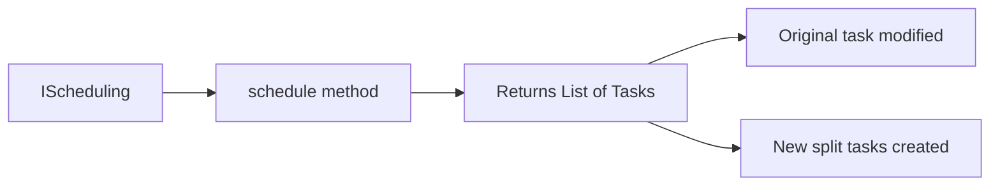
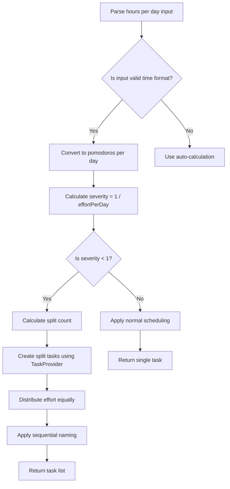

# Enhanced Scheduling Algorithm - Architectural Plan

## Overview

This document outlines the architectural plan for enhancing the `/schedule` command to support hours-per-day specification and automatic task splitting when severity would drop below 1.

## Current System Analysis

### Current Implementation Issues

Based on analysis of [`HeuristicScheduling.py`](../backend/src/HeuristicScheduling.py:13), the current scheduling algorithm has several limitations:

1. **Limited Input Handling**: Only accepts numeric values for effort per day or falls back to auto-calculation
2. **No Task Splitting**: When severity calculations result in values below 1, the system doesn't handle this optimally
3. **Confusing Behavior**: Users report the scheduling doesn't work as intended
4. **Single Task Operation**: Always operates on one task, never creates multiple tasks

### Current Algorithm Logic

The current [`schedule()`](../backend/src/HeuristicScheduling.py:13) method:
- Takes an `effortPerDay` parameter and calculates `severity = 1 / effortPerDay`
- Calculates optimal due date using: `ceil((r * (p * severity + 1)) / p)`
- When no numeric param provided, uses: `max((d * p - r) / (p * r), 1)`

Where:
- `d` = remaining days to due date
- `p` = daily dedication in pomodoros 
- `r` = total remaining effort in pomodoros

## Proposed Solution

### New Algorithm Requirements

1. **Hours-per-Day Input**: Accept time specifications like "2h", "3.5h", "4p" for daily effort
2. **Severity Threshold**: When calculated severity < 1, split the task into multiple instances
3. **Task Creation**: Generate multiple independent tasks with sequential naming
4. **Effort Distribution**: Distribute total effort evenly across split tasks

### Architecture Changes

#### 1. Enhanced Scheduling Interface



**Interface Changes**:
- Modify [`IScheduling.schedule()`](../backend/src/Interfaces/IScheduling.py:8) to return `List[ITaskModel]`
- Update method signature: `schedule(task: ITaskModel, param: str) -> List[ITaskModel]`

#### 2. Task Provider Usage

**Leverage Existing Methods**:
- Use [`createDefaultTask()`](../backend/src/Interfaces/ITaskProvider.py:22) to create new task instances
- Copy properties manually from original task to new tasks
- Use existing [`saveTask()`](../backend/src/Interfaces/ITaskProvider.py:18) for each task individually
- **Optional Enhancement**: Add [`saveTasks()`](../backend/src/Interfaces/ITaskProvider.py) batch method for optimization

#### 3. Enhanced HeuristicScheduling Logic



**Split Calculation Logic**:
```python
if severity < 1:
    # Calculate how many splits needed to get severity >= 1
    split_count = ceil(1 / severity)
    effort_per_split = total_effort / split_count
    # Each split gets same due date spread over time
```

### Implementation Details

#### 1. Time Input Parsing

Enhance parameter parsing to handle:
- Hours: "2h", "3.5h" 
- Minutes: "90m", "120m"
- Pomodoros: "4p", "6.5p"

#### 2. Task Splitting Algorithm

```python
def split_task_if_needed(self, task: ITaskModel, effort_per_day: float, task_provider: ITaskProvider) -> List[ITaskModel]:
    severity = 1 / effort_per_day
    
    if severity >= 1:
        # Normal scheduling - no split needed
        return [self.apply_normal_scheduling(task, effort_per_day)]
    
    # Calculate split requirements
    split_count = ceil(1 / severity)
    optimal_effort_per_day = 1.0  # Target severity = 1
    total_effort = task.getTotalCost().as_pomodoros()
    effort_per_split = total_effort / split_count
    
    # Create split tasks
    split_tasks = []
    original_description = task.getDescription()
    
    for i in range(split_count):
        if i == 0:
            # Modify original task
            split_task = task
        else:
            # Create new task using TaskProvider
            split_task = task_provider.createDefaultTask(f"{original_description} {i+1}/{split_count}")
            # Copy properties from original
            self.copy_task_properties(task, split_task)
            
        # Apply sequential naming
        split_task.setDescription(f"{original_description} {i+1}/{split_count}")
        split_task.setTotalCost(TimeAmount(f"{effort_per_split}p"))
        
        # Apply optimal scheduling with severity = 1
        self.apply_normal_scheduling(split_task, optimal_effort_per_day)
        split_tasks.append(split_task)
    
    return split_tasks

def copy_task_properties(self, source: ITaskModel, target: ITaskModel) -> None:
    """Copy all relevant properties from source to target task"""
    target.setContext(source.getContext())
    target.setStart(source.getStart())
    target.setDue(source.getDue())
    target.setSeverity(source.getSeverity())
    target.setTotalCost(source.getTotalCost())
    target.setInvestedEffort(source.getInvestedEffort())
    target.setStatus(source.getStatus())
    target.setCalm(source.getCalm())
    # Note: Project property might need special handling if not settable
```

#### 3. Service Integration

Update [`TelegramReportingService.scheduleCommand()`](../backend/src/TelegramReportingService.py:518):

```python
async def scheduleCommand(self, messageText: str = "", expectAnswer: bool = True, reqId: int | None = None) -> None:
    selected_task = self.taskListManager.getSelectedTask()
    if selected_task is not None:
        # Enhanced scheduling returns list of tasks
        resulting_tasks = self.scheduling.schedule(selected_task, params.pop() if len(params) > 0 else "")
        
        # Handle multiple tasks
        if len(resulting_tasks) > 1:
            # Task was split - save all and report
            for task in resulting_tasks:
                self.taskProvider.saveTask(task)
            await self.send_message(f"Task split into {len(resulting_tasks)} parts", expectAnswer, reqId)
        else:
            # Normal single task scheduling
            self.taskProvider.saveTask(resulting_tasks[0])
            await self.send_message("Task rescheduled", expectAnswer, reqId)
```

#### 4. Dependency Injection

The [`HeuristicScheduling`](../backend/src/HeuristicScheduling.py) class will need access to [`ITaskProvider`](../backend/src/Interfaces/ITaskProvider.py):

```python
class HeuristicScheduling(IScheduling):
    def __init__(self, dedication: TimeAmount, task_provider: ITaskProvider):
        self.__dedication = dedication
        self.__task_provider = task_provider

    def schedule(self, task: ITaskModel, param: str) -> List[ITaskModel]:
        # Implementation using self.__task_provider
```

### Testing Strategy

#### 1. Unit Tests

Test scenarios for [`HeuristicScheduling`](../backend/src/HeuristicScheduling.py):
- Normal scheduling (severity >= 1)
- Task splitting (severity < 1) 
- Various time input formats
- Edge cases (very small efforts, very large tasks)
- Task property copying accuracy

#### 2. Integration Tests  

Test scenarios for [`TelegramReportingService`](../backend/src/TelegramReportingService.py):
- `/schedule` command with normal parameters
- `/schedule` command triggering task split
- Error handling for invalid inputs
- Task provider interactions

### Risk Assessment

#### Technical Risks

1. **Breaking Changes**: Modifying [`IScheduling`](../backend/src/Interfaces/IScheduling.py) interface affects all implementations
   - **Mitigation**: Implement backward-compatible wrapper or staged migration

2. **Task Provider Dependency**: Adding dependency injection increases complexity
   - **Mitigation**: Use existing container pattern from [`TelegramReportingServiceContainer`](../backend/src/containers/TelegramReportingServiceContainer.py)

3. **Data Consistency**: Multiple task creation could lead to inconsistent states
   - **Mitigation**: Implement proper error handling and rollback mechanisms

#### User Experience Risks

1. **Unexpected Behavior**: Users might not expect task splitting
   - **Mitigation**: Clear messaging when splitting occurs, preview before execution

2. **Task Management Overhead**: More tasks in list could overwhelm users
   - **Mitigation**: Consider task grouping or filtering features

### Migration Plan

#### Phase 1: Interface Updates
- Update [`IScheduling`](../backend/src/Interfaces/IScheduling.py) interface
- Create enhanced [`HeuristicScheduling`](../backend/src/HeuristicScheduling.py) implementation with dependency injection
- Update container to inject [`ITaskProvider`](../backend/src/Interfaces/ITaskProvider.py)

#### Phase 2: Core Logic Implementation
- Implement time input parsing
- Implement task splitting algorithm
- Implement task property copying
- Create comprehensive unit tests

#### Phase 3: Service Integration
- Update [`TelegramReportingService`](../backend/src/TelegramReportingService.py)
- Handle multiple task creation flow
- Create integration tests

#### Phase 4: Testing & Validation
- End-to-end testing
- Performance testing with large tasks
- User acceptance testing

### Success Criteria

1. **Functional Requirements**
   - `/schedule` command accepts hours-per-day input
   - Tasks automatically split when severity < 1
   - Split tasks have sequential naming format "Task X/Y"
   - Original behavior preserved for normal cases

2. **Quality Requirements**
   - All existing tests continue to pass
   - New functionality has >= 90% test coverage
   - No performance degradation for normal scheduling

3. **User Experience**
   - Clear feedback when task splitting occurs
   - Intuitive time input formats accepted
   - Consistent behavior across different task types

## Conclusion

This enhancement will significantly improve the scheduling system's usability while maintaining backward compatibility. The modular design leverages existing [`ITaskProvider`](../backend/src/Interfaces/ITaskProvider.py) methods and ensures changes are contained and testable, while the phased implementation reduces risk and allows for iterative improvement.